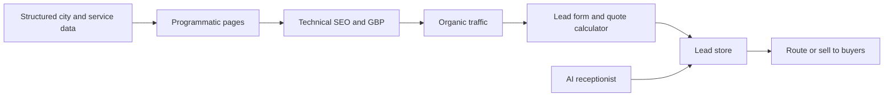

# Local Lead Gen

> Programmatic local SEO sites that generate and sell service leads, the rank and rent model.

A Next.js platform that spins up programmatic local service SEO sites across many cities and services, ranks them, captures leads, and routes or sells those leads to local businesses. It includes an AI voice receptionist and an outreach engine for signing renters.

> This repository is an architecture overview. The production code and data are private.

## How it works

## Stack

**Web** &nbsp; Next.js, React, TypeScript, Tailwind
**SEO** &nbsp; Programmatic pages, schema, sitemaps, internal linking, Lighthouse
**Voice and AI** &nbsp; VAPI receptionist, renter acquisition outreach
**Monetization** &nbsp; Lead buyers, Gumroad, Ezoic
**Cloud** &nbsp; AWS EC2, PM2
**Analytics** &nbsp; Plausible, A/B testing

## Engineering highlights

- Programmatic generation of city by service landing pages at scale, built from structured data into thousands of unique pages.
- Full technical SEO: structured data schema, sitemaps, internal linking, Lighthouse checks, and English and Spanish localization.
- A conversion suite with an instant quote calculator, exit intent capture, sticky mobile CTAs, and A/B testing.
- An AI voice receptionist plus a renter acquisition outreach pool for signing site renters.
- Lead routing and sale to buyers, with billing and a growth monitor.
- Multi site deployment on EC2 with PM2 process management.

## Status

Built and deployed.

---

Part of the work of [Denis Redzic](https://denis.denisai.online).
